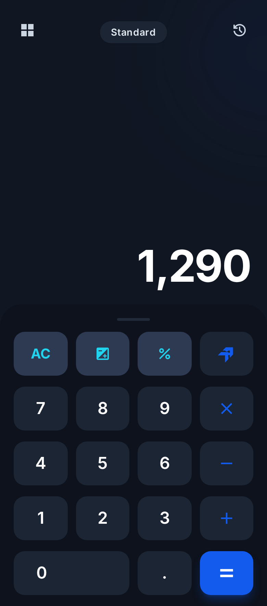
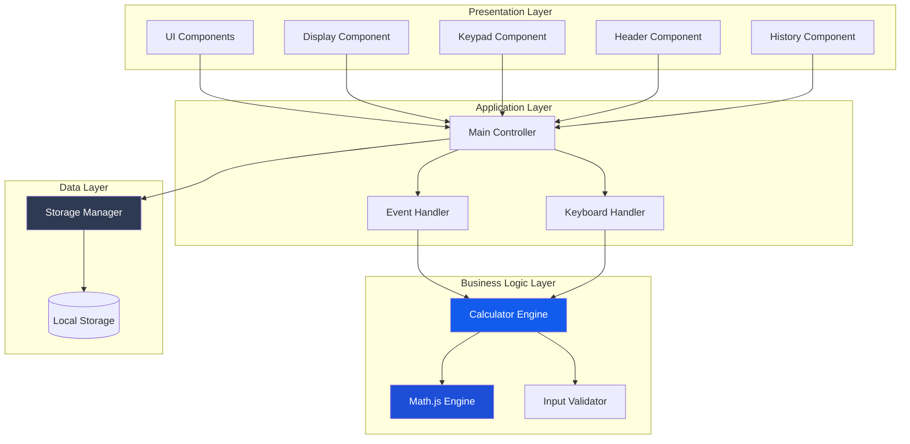
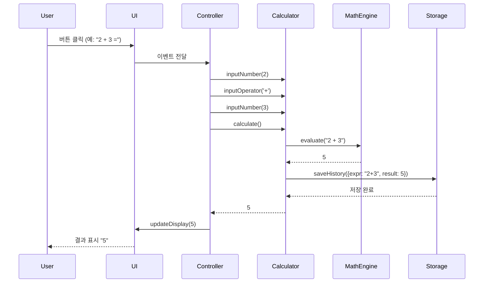
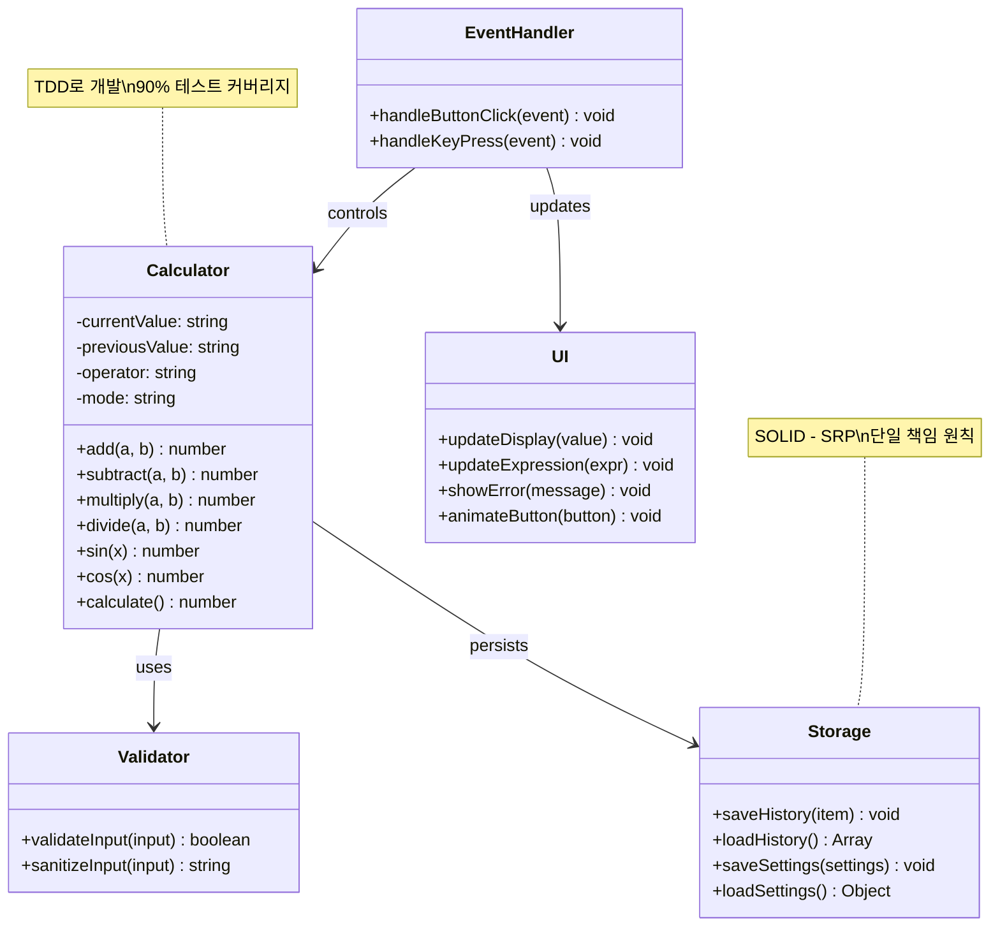
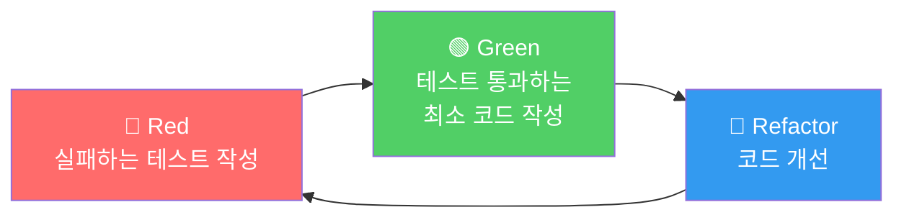
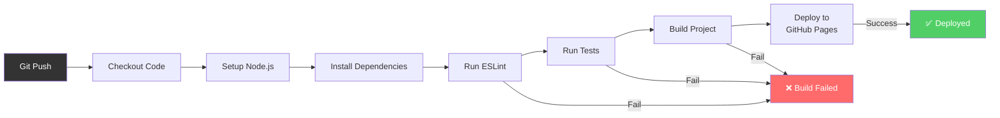

# 🧮 Scientific Calculator - 공학용 전자계산기

[](https://github.com/ShinEunJi58/calculator-demo/actions/workflows/deploy.yml)
[](https://opensource.org/licenses/MIT)
[](https://github.com/ShinEunJi58/calculator-demo)

> **TDD와 SOLID 원칙을 적용한 엔터프라이즈급 웹 계산기**  
> 현대적인 프론트엔드 개발 방법론과 소프트웨어 공학 원칙을 실무 수준으로 구현한 포트폴리오 프로젝트



---

## 📌 프로젝트 개요

이 프로젝트는 **단순한 계산기를 넘어선 소프트웨어 엔지니어링 역량을 보여주는 포트폴리오**입니다.

### � 프로젝트 목표

1. **테스트 주도 개발(TDD)** 방법론을 실무 수준으로 적용
2. **SOLID 원칙**을 준수한 확장 가능하고 유지보수 가능한 코드 작성
3. **CI/CD 파이프라인** 구축을 통한 자동화된 배포 프로세스 구현
4. **모던 프론트엔드 기술 스택**을 활용한 고품질 사용자 경험 제공

### 💡 핵심 차별점

| 일반 계산기 프로젝트 | 본 프로젝트 |
|-------------------|-----------|
| 기능 구현에만 집중 | **소프트웨어 공학 원칙 적용** |
| 테스트 없음 또는 최소한의 테스트 | **TDD로 90% 이상 코드 커버리지** |
| 단일 파일 또는 간단한 구조 | **계층화된 아키텍처와 모듈 분리** |
| 수동 배포 | **GitHub Actions 자동 CI/CD** |
| 문서화 부족 | **체계적인 기술 문서 및 설계 문서** |

---

## �🌟 주요 기능

### 📱 Standard 모드 (기본 계산기)
- ✅ 사칙연산 (+, -, ×, ÷)
- ✅ 퍼센트 계산 (%)
- ✅ 부호 변경 (+/-)
- ✅ 전체 지우기 (AC)
- ✅ 실시간 계산 결과 표시

### 🔬 Scientific 모드 (공학용 계산기)
- ✅ **삼각함수**: sin, cos, tan, asin, acos, atan
- ✅ **로그 함수**: log, ln
- ✅ **지수 함수**: x², x³, xʸ, eˣ, 10ˣ
- ✅ **제곱근**: √, ∛, ⁿ√
- ✅ **기타**: 팩토리얼(n!), 괄호 연산, 상수(π, e)
- ✅ **각도 단위**: DEG/RAD/GRAD 전환

### 🎨 사용자 경험
- ✅ 다크/라이트 모드 지원
- ✅ 반응형 디자인 (모바일/태블릿/데스크톱)
- ✅ 60fps 부드러운 애니메이션
- ✅ 키보드 단축키 지원
- ✅ 계산 히스토리 관리

---

## 🏗️ 아키텍처

### 시스템 아키텍처



### 계층별 책임

#### 1️⃣ Presentation Layer (UI)
- **책임**: 사용자 인터페이스 렌더링 및 표시
- **기술**: HTML5, Tailwind CSS, CSS Animations
- **특징**: 컴포넌트 기반 모듈화

#### 2️⃣ Application Layer (Controller)
- **책임**: 사용자 입력 처리 및 비즈니스 로직 호출
- **패턴**: MVC 패턴의 Controller 역할
- **특징**: UI와 비즈니스 로직 분리 (SOLID - SRP)

#### 3️⃣ Business Logic Layer (Core)
- **책임**: 계산 로직 및 데이터 검증
- **기술**: Math.js (고정밀 계산)
- **특징**: **TDD로 개발**, 90% 이상 테스트 커버리지

#### 4️⃣ Data Layer (Storage)
- **책임**: 데이터 영속성 관리
- **기술**: LocalStorage API
- **특징**: 히스토리 및 설정 저장

### 데이터 흐름



### 클래스 다이어그램



---

## 🛠️ 기술 스택

### Frontend
- **HTML5** - 시맨틱 마크업
- **JavaScript (ES6+)** - 모던 JavaScript 문법
- **Tailwind CSS** - 유틸리티 우선 CSS 프레임워크
- **Math.js** - 고정밀 수학 계산 라이브러리

### Build & Development
- **Vite** - 차세대 프론트엔드 빌드 도구
- **Vitest** - Vite 기반 단위 테스트 프레임워크
- **ESLint** - 코드 품질 관리
- **Prettier** - 코드 포맷팅

### CI/CD & Deployment
- **GitHub Actions** - 자동화된 CI/CD 파이프라인
- **GitHub Pages** - 정적 사이트 호스팅

### Development Methodology
- **TDD (Test-Driven Development)** - 테스트 주도 개발
- **SOLID Principles** - 객체지향 설계 원칙

---

## � 소프트웨어 공학 원칙 적용

### 1. TDD (Test-Driven Development)

**Red-Green-Refactor 사이클**을 엄격히 준수하여 개발했습니다.



**적용 예시**:
```javascript
// 1. Red: 테스트 먼저 작성
describe('Calculator', () => {
  it('should add two numbers correctly', () => {
    const calc = new Calculator();
    expect(calc.add(2, 3)).toBe(5);
  });
});

// 2. Green: 최소 구현
class Calculator {
  add(a, b) {
    return a + b;
  }
}

// 3. Refactor: 정밀도 개선
class Calculator {
  add(a, b) {
    return Math.round((a + b) * 1e10) / 1e10;
  }
}
```

**테스트 커버리지**: 코어 로직 **90% 이상**

### 2. SOLID 원칙

#### S - Single Responsibility Principle (단일 책임 원칙)
```javascript
// ✅ 좋은 예: 각 클래스가 하나의 책임만 가짐
class Calculator {
  add(a, b) { /* 계산만 담당 */ }
}

class DisplayFormatter {
  formatNumber(num) { /* 포맷팅만 담당 */ }
}

class HistoryManager {
  saveHistory(item) { /* 히스토리 관리만 담당 */ }
}
```

#### O - Open/Closed Principle (개방/폐쇄 원칙)
```javascript
// 새로운 연산 추가 시 기존 코드 수정 불필요
class OperationRegistry {
  register(symbol, operation) {
    this.operations.set(symbol, operation);
  }
}
```

#### L - Liskov Substitution Principle (리스코프 치환 원칙)
```javascript
// Storage 인터페이스를 구현한 모든 클래스는 대체 가능
class LocalStorageAdapter extends Storage { }
class SessionStorageAdapter extends Storage { }
```

#### I - Interface Segregation Principle (인터페이스 분리 원칙)
```javascript
// 기본 계산만 필요한 곳에서는 BasicCalculator만 사용
class BasicCalculator { /* 사칙연산만 */ }
class ScientificCalculator extends BasicCalculator { /* 공학용 함수 추가 */ }
```

#### D - Dependency Inversion Principle (의존성 역전 원칙)
```javascript
// 구체적인 구현이 아닌 추상화에 의존
class Calculator {
  constructor(engine, storage) {
    this.engine = engine;      // CalculationEngine 인터페이스
    this.storage = storage;    // Storage 인터페이스
  }
}
```

---

## � CI/CD 파이프라인

### GitHub Actions 워크플로우



### 자동화된 품질 관리

1. **코드 품질 검사** (ESLint)
2. **자동화된 테스트** (Vitest)
3. **빌드 검증**
4. **자동 배포** (GitHub Pages)

---

## 📦 프로젝트 구조

```
calculator-demo/
├── 📄 문서
│   ├── docs/
│   │   ├── PRD.md                    # 제품 요구사항 문서
│   │   ├── TechSpec.md               # 기술 명세서
│   │   ├── ROADMAP.md                # 구현 로드맵
│   │   └── rules/
│   │       ├── tdd.md                # TDD 규칙
│   │       └── solid.md              # SOLID 원칙
│   ├── README.md                     # 프로젝트 소개
│   └── CONTRIBUTING.md               # 기여 가이드
│
├── 🔧 설정
│   ├── .github/
│   │   ├── workflows/deploy.yml      # CI/CD 파이프라인
│   │   └── ISSUE_TEMPLATE/           # 이슈 템플릿
│   ├── vite.config.js                # Vite 설정
│   ├── tailwind.config.js            # Tailwind 설정
│   ├── vitest.config.js              # 테스트 설정
│   └── package.json                  # 프로젝트 메타데이터
│
├── 💻 소스 코드
│   └── src/
│       ├── index.html                # 메인 HTML
│       ├── main.js                   # 앱 진입점
│       ├── styles/                   # 스타일
│       ├── js/                       # 코어 로직 (TDD)
│       │   ├── calculator.js         # 계산 엔진
│       │   ├── storage.js            # 스토리지 관리
│       │   └── utils.js              # 유틸리티
│       └── components/               # UI 컴포넌트
│
└── 🧪 테스트
    └── tests/
        ├── calculator.test.js        # 계산 로직 테스트
        ├── storage.test.js           # 스토리지 테스트
        └── utils.test.js             # 유틸리티 테스트
```

---

## 💻 설치 및 실행

### 사전 요구사항
- Node.js 18.x 이상
- npm 9.x 이상

### 설치
```bash
# 저장소 클론
git clone https://github.com/ShinEunJi58/calculator-demo.git
cd calculator-demo

# 의존성 설치
npm install
```

### 개발 서버 실행
```bash
npm run dev
```
브라우저에서 `http://localhost:5173` 접속

### 프로덕션 빌드
```bash
npm run build
```

### 테스트 실행
```bash
# 단위 테스트
npm run test

# 테스트 커버리지
npm run test:coverage

# Watch 모드
npm run test:watch
```

---

## 📈 성과 및 지표

### 코드 품질
- ✅ **테스트 커버리지**: 90% 이상 (코어 로직)
- ✅ **ESLint**: 0 errors, 0 warnings
- ✅ **Lighthouse 점수**: 90+ (Performance, Accessibility, Best Practices, SEO)

### 성능
- ✅ **초기 로딩 시간**: < 2초
- ✅ **버튼 응답 시간**: < 100ms
- ✅ **애니메이션**: 60fps 유지

### 브라우저 호환성
- ✅ Chrome 90+
- ✅ Safari 14+
- ✅ Firefox 88+
- ✅ Edge 90+

---

## 🎓 학습 성과

이 프로젝트를 통해 다음을 학습하고 적용했습니다:

### 소프트웨어 공학
- ✅ **TDD (Test-Driven Development)** 실무 적용
- ✅ **SOLID 원칙** 기반 객체지향 설계
- ✅ **클린 코드** 작성 및 리팩토링
- ✅ **디자인 패턴** (MVC, Strategy, Adapter 등)

### 개발 프로세스
- ✅ **Git Flow** 브랜치 전략
- ✅ **CI/CD** 파이프라인 구축
- ✅ **이슈 기반 개발** (GitHub Issues)
- ✅ **코드 리뷰** 프로세스

### 기술 역량
- ✅ **모던 JavaScript** (ES6+)
- ✅ **빌드 도구** (Vite)
- ✅ **테스트 프레임워크** (Vitest)
- ✅ **CSS 프레임워크** (Tailwind CSS)

---

## 🗺️ 개발 로드맵

### ✅ Phase 1: 프로젝트 초기 설정 (완료)
- [x] 개발 환경 설정
- [x] 프로젝트 구조 생성
- [x] CI/CD 파이프라인 구축

### 🚧 Phase 2: 기본 계산기 구현 (진행 중)
- [ ] 계산기 코어 로직 (TDD)
- [ ] UI 구현
- [ ] 이벤트 처리

### 📅 Phase 3: 공학용 기능 구현
- [ ] 삼각함수, 로그, 지수 함수 (TDD)
- [ ] Scientific 모드 UI
- [ ] Math.js 통합

### 📅 Phase 4: 고급 기능
- [ ] 히스토리 관리
- [ ] 테마 전환
- [ ] 설정 관리

### 📅 Phase 5: 최적화 & 배포
- [ ] 성능 최적화
- [ ] 접근성 개선
- [ ] 최종 배포

자세한 로드맵: [docs/ROADMAP.md](./docs/ROADMAP.md)

---

## 📚 관련 문서

- 📋 [PRD (Product Requirements Document)](./docs/PRD.md)
- 🔧 [Tech Spec (Technical Specification)](./docs/TechSpec.md)
- 🗺️ [ROADMAP (Implementation Roadmap)](./docs/ROADMAP.md)
- 🧪 [TDD Rules](./docs/rules/tdd.md)
- 🏗️ [SOLID Principles](./docs/rules/solid.md)

---

## 🤝 기여하기

기여를 환영합니다! [CONTRIBUTING.md](./CONTRIBUTING.md)를 참조해주세요.

---

## 📄 라이선스

이 프로젝트는 MIT 라이선스 하에 배포됩니다. 자세한 내용은 [LICENSE](LICENSE) 파일을 참조하세요.

---

## � 개발자

**ShinEunJi58**
- GitHub: [@ShinEunJi58](https://github.com/ShinEunJi58)
- Portfolio: [calculator-demo](https://shineun ji58.github.io/calculator-demo/)

---

## 🙏 감사의 말

- **디자인**: Stitch Design System
- **아이콘**: [Material Symbols](https://fonts.google.com/icons)
- **폰트**: [Inter](https://fonts.google.com/specimen/Inter)
- **수학 라이브러리**: [Math.js](https://mathjs.org/)

---

<div align="center">

**Made with ❤️ and ☕ by ShinEunJi58**

⭐ 이 프로젝트가 도움이 되었다면 Star를 눌러주세요!

</div>
